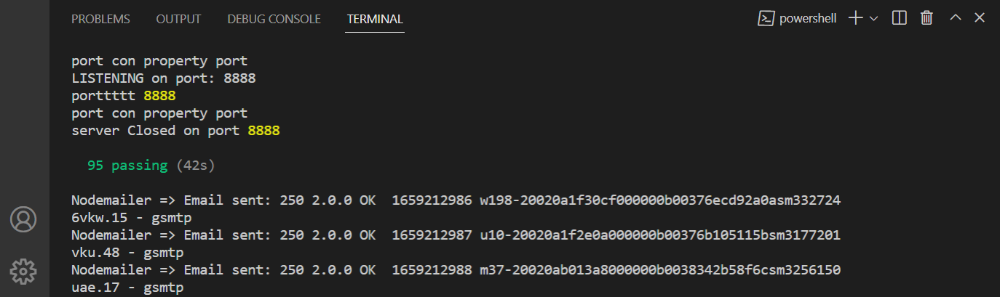

# REST API Alkemy Challenge
### Disney World API

This is a non production example of NodeJs application providing a REST
API.

The entire application could be up and running with `app.js` file. You will need to make some configurations before.

### For Authentication
I used 2 Strategies which are up and running. 
- Local Strategy Authentication: use Sessions and cookies, this is configured with MongoDB and moongoose to store sessions you also have a view form in the respective endpoint. /api/auth/login and /api/auth/register. Module used: Local-Passport [http://passportjs.org]
- JWT Strategy Authentication: there is no need for store sessions, so we dont need database, when you register/login using POST request we will send you a Token via email. Module used: JWT-Passport [http://passportjs.org]

`/test` folder contains all test use cases created for this app.

`generateKeyPaid.js` will let you generate a public and private Key. We will use it for JWT Authentication (JSON Web Tokens)

`configs.js` is where you have to add some data configurations before running the app.

## .Create a .env File with:
 You have to change/add some values required for app

    # Express Port (By Default port = 0 for Random port)
    PORT = "3000"

    # option 2 is "mongo", Sequelize DAO is complete for requirements, mongo is complete only for authenticate users.
    DAO_TYPE="sequelize"

    # MongoDB is for Local Authentication Strategy only
    MONGO_DB_NAME ="MongoDatabaseName"
    CNX_STRING_MONGO = "mongodb+srv://..."

    # You can decide which service email sender use
    GMAIL_FOR_NODEMAILER_USER="eli....@gmail.com"
    GMAIL_PASSWORD_FOR_NODEMAILER="providesGmail"
    SENDGRID_API_KEY="SomeApiKeyAfterYouRegister"
    SENDGRID_USER_EMAIL="eli.....@gmail.com"
    EMAIL_SENDER_SERVICE_FAULT="nodemailer"

    # The other option is "local" for Local Strategy Auth
    STRATEGY_AUTH= "jwt"

    # All requirements are completed using Postgres and Sequelize
    PASSWORD_DB_POSTGRES = "somepassword"
    DATABASE_POSTGRES = "postgres"
    USER_DATABASE_POSTGRES = "postgres"
    DATABASE_HOST_SEQUELIZE = "localhost"
    DIALECT_SEQUELIZE = "postgres"

## Install

    npm install

## Create a RSA encrypted key pair

    node /src/utils/generateKeypair.js

## Run the tests

    npm run tdd

# REST API

### Endpoints starts with: [Base URL]/api

The REST API to the example app is described below. I will list only the endpoints requested according the requirements documentation.
Some endpoints for Local Strategy Authentication will not shown. 

This endpoints are protected by JWT Authentication
You will need to get a Bearer Token .

# DOCUMENTATION AND ENDPOINTS DETAILS
This API is documented with POSTMAN. 
You can see the published documentation here:

https://documenter.getpostman.com/view/12699741/UzdzU5aZ

